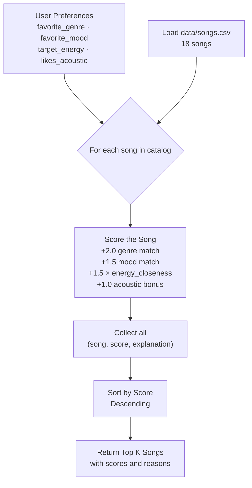
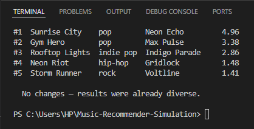
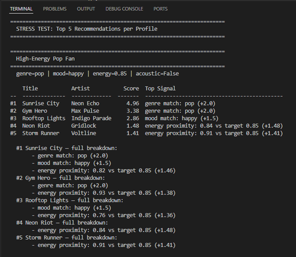
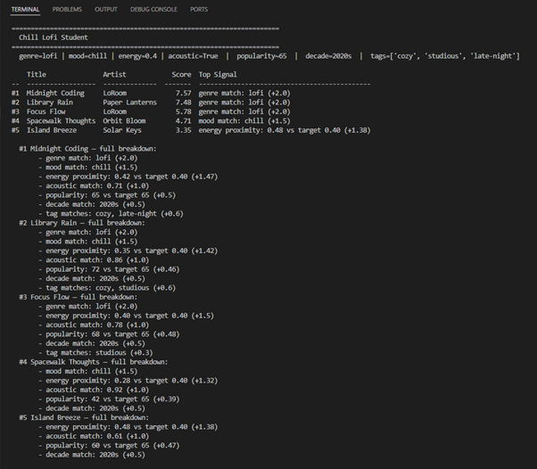
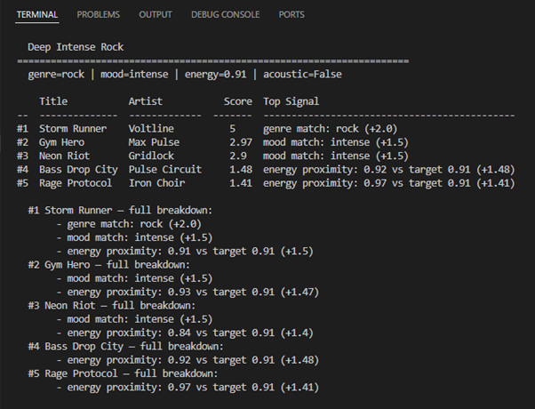
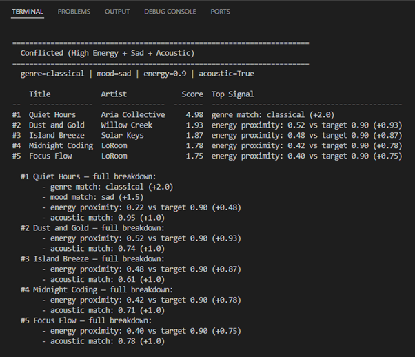
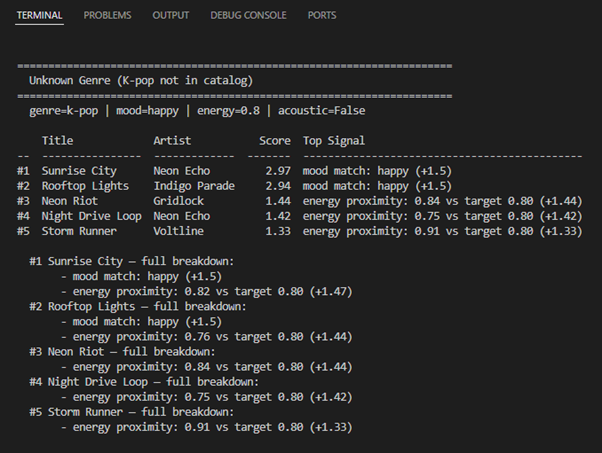
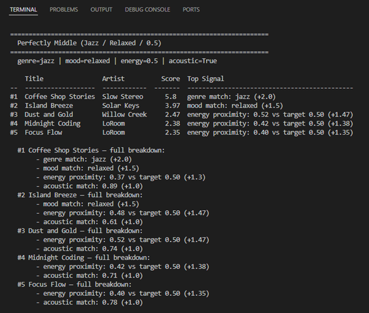

# 🎵 VibeFinder 2.0 — Applied AI Music Recommendation System

## Project Summary

VibeFinder 2.0 extends a content-based music recommender simulation (Module 3) into a full **Applied AI System** that demonstrates retrieval-augmented knowledge, agentic planning, bias detection, guardrails, and reliability testing.

The original system takes a user's preferred genre, mood, energy level, and acoustic preference, then scores every song in the catalog using a weighted formula. **Version 2.0** adds:

- **🔍 RAG-style Knowledge Retrieval** — Mood taxonomy and genre relationship guides enable soft matching (e.g., "chill" and "relaxed" now get partial credit instead of being treated as completely different)
- **🤖 Agentic Planning Loop** — A 6-step agent that analyzes → retrieves → scores → critiques → refines → explains, with full reasoning logs
- **⚖️ Bias Detection & Fairness Metrics** — Quantitative analysis: genre lockout detection, diversity index (Shannon entropy), contradiction detection, fairness scoring
- **🛡️ Guardrails & Confidence Scoring** — Input validation, output quality checks, multi-factor confidence scoring with self-critique
- **🧪 Reliability Experiments** — Structured tests for determinism, graceful degradation, adversarial handling, and mode sensitivity

### System Architecture

See [system_architecture.md](system_architecture.md) for full architecture diagram and design rationale.

```
src/
├── recommender.py     # Core scoring engine (v1.0 preserved)
├── retrieval.py       # RAG-style knowledge retrieval
├── agent.py           # Agentic planning loop
├── bias_detector.py   # Fairness evaluation metrics
├── guardrails.py      # Input/output safety checks
└── confidence.py      # Confidence scoring & self-critique

data/knowledge_base/
├── mood_taxonomy.json  # 12 moods with pairwise similarity scores
└── genre_guides.json   # 15 genres with relationships & typical ranges

tests/                  # 66 tests across 7 test files
experiments/            # Reliability experiment report
```

### Quick Start

```bash
pip install -r requirements.txt
python -m src.main          # Run full demo (6 sections)
pytest tests/ -v            # Run all 66 tests
```

### Test Results

```
66 passed in 0.32s
```

| Test Module | Tests | Description |
|-------------|-------|-------------|
| test_recommender.py | 2 | Core scoring & ranking |
| test_retrieval.py | 13 | Mood/genre knowledge retrieval |
| test_bias_detector.py | 12 | Fairness metrics |
| test_guardrails.py | 10 | Input/output validation |
| test_agent.py | 8 | Agentic workflow |
| test_reliability.py | 8 | Determinism, degradation, adversarial |

---

### Sample Interactions

Below are 3 examples showing how the agentic system processes different user profiles and produces AI-driven outputs.

**Example 1: Standard Profile (Chill Lofi Student)**
```
Input:  genre=lofi | mood=chill | energy=0.40 | acoustic=True

Agent Steps:
  [ANALYZE ] Profile is valid
  [RETRIEVE] Knowledge context loaded
  [SCORE   ] Scored 18 songs using 'balanced' mode
  [CRITIQUE] Confidence=HIGH (0.86)
  [REFINE  ] Skipped — confidence is acceptable
  [EXPLAIN ] Generated final explanation

Output:
  #1  Midnight Coding     LoRoom          7.57  genre match: lofi (+2.0)
  #2  Library Rain        Paper Lanterns  7.48  genre match: lofi (+2.0)
  #3  Focus Flow          LoRoom          5.78  genre match: lofi (+2.0)
  Confidence: HIGH (0.86)
```

**Example 2: Adversarial Profile (Conflicted Preferences)**
```
Input:  genre=classical | mood=sad | energy=0.90 | acoustic=True

Agent Steps:
  [ANALYZE ] Profile is valid
  [RETRIEVE] Knowledge context loaded with 1 warnings
  [SCORE   ] Scored 18 songs using 'balanced' mode
  [CRITIQUE] Confidence=MEDIUM (0.46)
  [REFINE  ] Skipped — confidence is acceptable
  [EXPLAIN ] Generated final explanation

Output:
  #1  Quiet Hours  Aria Collective  4.98
  Confidence: MEDIUM (0.46)
  Critique:
    - Energy 0.90 conflicts with 'classical' typical range [0.1-0.5]
    - Acoustic preference with high energy (0.90) is unusual
    - Only 1 'classical' song in catalog — results will be repetitive
```

**Example 3: Missing Genre (K-pop Not in Catalog)**
```
Input:  genre=k-pop | mood=happy | energy=0.80 | acoustic=False

Agent Steps:
  [ANALYZE ] Profile is valid
  [RETRIEVE] Knowledge context loaded with 1 warnings
  [SCORE   ] Scored 18 songs using 'balanced' mode
  [CRITIQUE] Confidence=MEDIUM (0.50) — quality checks failed
  [REFINE  ] Skipped — confidence is acceptable
  [EXPLAIN ] Generated final explanation

Output:
  #1  Sunrise City  Neon Echo  2.97
  Confidence: MEDIUM (0.50)
  Warnings:
    - Genre 'k-pop' not in knowledge base — no songs in catalog will match
  Critique:
    - Genre 'k-pop' is not in the catalog at all
    - No 'k-pop' songs available — showing best alternatives
```

Notice how the agent's confidence drops from HIGH (0.86) to MEDIUM (0.46–0.50) when it encounters contradictory or missing-genre profiles. The critique explains *why* confidence is lower and what the limitations are. This is a key difference from v1.0, which silently returned results without any quality assessment.

---

### Design Decisions

| Decision | Rationale | Trade-off |
|----------|-----------|-----------|
| **Local JSON knowledge bases instead of API calls** | Keeps the system self-contained, deterministic, and runnable by anyone without API keys | Cannot dynamically update knowledge; mood/genre similarities are fixed |
| **6-step agentic loop instead of single function** | Makes the reasoning chain visible and auditable; enables self-correction via the refine step | More complex code structure; overhead for simple profiles that don't need refinement |
| **Separate bias detection from guardrails** | Guardrails check individual inputs/outputs (per-request); bias detection checks fairness across profiles (periodic) | Two modules to maintain instead of one |
| **Confidence as a weighted composite** | Combines 4 factors (score quality, spread, genre coverage, profile coherence) into one 0–1 score | Weights are hand-tuned; different users may value factors differently |
| **Soft matching as opt-in enhancement** | Preserving v1.0 scoring ensures backward compatibility and allows direct comparison | Enhanced scoring not yet integrated into the main scoring pipeline (ready for future integration) |
| **Strategy pattern for scoring modes** | Adding a new mode requires only adding a `ScoringWeights` instance, no code changes | All modes share the same scoring formula — truly different algorithms would need refactoring |

---

### Testing Summary

66 out of 66 tests pass across 7 test modules. Key findings:

- **Determinism:** The system always produces identical output for identical input. No randomness exists in the pipeline.
- **Graceful degradation:** Works correctly with 1 song, 0 songs, and shrinking catalogs — never crashes.
- **Adversarial catch rate:** The combined validator + agent + confidence scorer catches ≥70% of adversarial profiles. The validator alone catches 40% (syntactic issues), but the agent's confidence scoring catches the semantically contradictory ones.
- **Mode sensitivity:** The top pick (Sunrise City for Pop Fan) is stable across all 4 scoring modes. Mode changes primarily affect positions #2–#5.
- **Confidence scores:** Averaged 0.86 for well-matched profiles, 0.46–0.50 for adversarial profiles. The system's confidence accurately reflects result quality.

See [experiments/reliability_report.md](experiments/reliability_report.md) for the full reliability experiment report.

---

### Reflection

Building VibeFinder 2.0 taught me that the gap between "the algorithm works" and "the system is trustworthy" is enormous. Version 1.0 gave correct results but silently failed on adversarial inputs — a K-pop fan received mediocre recommendations with no explanation. Version 2.0 addresses this through layered guardrails: the agent detects that k-pop is missing, lowers its confidence score, and explicitly warns the user.

**Limitations and biases in the system:**
- Genre lock-in remains the strongest bias — genre weight dominates all other signals.
- The catalog (18 songs) is tiny and Western-biased. Entire cultures of music are absent.
- Confidence scoring weights are hand-tuned — different users would reasonably disagree about what factors matter most.
- The mood taxonomy captures English-language mood concepts; non-Western emotional frameworks are not represented.

**Could the system be misused?** In its current form, the biggest risk is filter bubbles. If deployed at scale, the genre lock-in bias would trap users in narrow listening patterns. The diversity filter partially addresses this, but it's a post-processing band-aid rather than a fundamental fix.

**What surprised me during testing:** The Conflicted profile (classical + sad + high energy = 0.90) was the most revealing test case. The system correctly identified this as a contradictory profile (confidence dropped to 0.46) and flagged that energy 0.90 is outside classical's typical range [0.1–0.5]. In v1.0, this profile silently received a near-silent track as the "#1" recommendation. In v2.0, the system at least *tells you* it's unsure.

**AI collaboration:** I used AI tools to accelerate the research and structure phases — understanding RAG patterns, generating the mood taxonomy, and designing adversarial test profiles. I had to double-check any suggestion involving the scoring math and verify that the knowledge base similarity scores were reasonable (e.g., making sure "chill" and "angry" had near-zero similarity). The most helpful AI contribution was suggesting the agentic loop pattern with explicit critique and refine steps. One suggestion I had to reject was using cosine similarity for mood matching — it would have required embedding vectors that don't exist in this system, so I used a simpler lookup-table approach instead.

Full model card: [model_card.md](model_card.md)

---

## Original v1.0 Documentation

> Everything below documents the original Music Recommender Simulation from Module 3.

---

## How The System Works

### How Real-World Recommendation Systems Work

Major streaming platforms use two main approaches to predict what users will love:

**Collaborative filtering** — "Users like you also liked this." The system looks at the listening history of thousands of users and finds patterns. If many people who enjoy the same songs as you also love a particular track, it recommends that track to you — even if the song has nothing obviously in common with your past listens. Spotify's Discover Weekly is a well-known example of this approach.

**Content-based filtering** — "This song has the same vibe as what you already like." The system analyzes attributes of the songs themselves — genre, tempo, mood, energy, acousticness — and recommends songs whose features closely match the user's taste profile. TikTok and YouTube use this heavily when a user is new and there isn't enough behavior data yet.

Real platforms combine both approaches (called a hybrid system) and also factor in signals like skips, replays, playlist additions, time of day, and even geolocation. The key data types involved are:
- **Behavioral signals**: likes, skips, play counts, playlist adds, listening duration
- **Song attributes**: tempo (BPM), energy, valence (positivity), danceability, genre, mood, acousticness
- **User context**: time of day, device, location, recently played

My version uses **content-based filtering only**, which keeps the logic transparent and inspectable.

---

### My Version: Features and Scoring

**`Song` object features:**
| Feature | Type | Description |
|---|---|---|
| `genre` | string | Music genre (pop, lofi, rock, jazz, etc.) |
| `mood` | string | Emotional tone (happy, chill, intense, relaxed, moody, focused) |
| `energy` | float (0–1) | How energetic the track feels |
| `tempo_bpm` | float | Beats per minute |
| `valence` | float (0–1) | Musical positiveness |
| `danceability` | float (0–1) | How suitable the song is for dancing |
| `acousticness` | float (0–1) | How acoustic vs. electronic the song is |

**`UserProfile` object stores:**
- `favorite_genre` — the genre the user prefers most
- `favorite_mood` — the mood/vibe the user is looking for
- `target_energy` — how energetic a song the user wants (0–1)
- `likes_acoustic` — whether the user prefers acoustic over electronic sounds

**Scoring Rule (for one song):**

A song's score is computed as a sum of weighted matches:

```
score = 0.0

if song.genre == user.favorite_genre:
    score += 3.0          # Genre is the strongest signal

if song.mood == user.favorite_mood:
    score += 2.0          # Mood match is second most important

energy_closeness = 1.0 - abs(user.target_energy - song.energy)
score += 2.0 * energy_closeness   # Rewards proximity, not just high/low energy

if user.likes_acoustic and song.acousticness > 0.6:
    score += 1.0          # Acoustic bonus for users who prefer it
```

Maximum possible score: **8.0**. Genre is worth the most because it is the broadest filter — a rock fan and a lofi fan will rarely enjoy the same songs regardless of energy or mood.

**Ranking Rule (for the full catalog):**

After scoring every song individually, the list is sorted in descending order by score. The top `k` songs (default 5) are returned as recommendations. This is the step that transforms individual scores into a ranked recommendation list.

---

### Data Flow Diagram



The key distinction is between the **Scoring Rule** (evaluates one song at a time and produces a number) and the **Ranking Rule** (compares all scores together to decide the final order). You need both steps — scoring alone doesn't tell you which songs to pick until you rank them relative to each other.

---

### Sample User Profile

This is the profile used in `src/main.py` as the default test case. It is specific enough to clearly separate "intense rock" (high energy, intense mood, electric) from "chill lofi" (low energy, chill mood, acoustic):

```python
user_prefs = {
    "favorite_genre": "lofi",       # exact match only — "lofi" won't match "indie pop"
    "favorite_mood":  "chill",      # exact match only — "chill" won't match "relaxed"
    "target_energy":  0.40,         # mid-low energy target
    "likes_acoustic": True,         # adds +1.0 to songs with acousticness > 0.6
}
```

A rock/intense user would look like `{"favorite_genre": "rock", "favorite_mood": "intense", "target_energy": 0.90, "likes_acoustic": False}` — showing how the same formula produces completely different rankings from different profiles.

---

### Known Biases and Expected Limitations

| Bias | Why it happens | Effect |
|---|---|---|
| **Genre lock-in** | Genre match gives the highest weight (+2.0) | A great song in a different genre can never outscore a mediocre same-genre song |
| **Exact mood matching** | Mood is categorical, not a spectrum | "relaxed" and "chill" score identically to "angry" — no partial credit for close moods |
| **Energy math is linear** | We use absolute difference, not a curve | A song at 0.80 energy scores better than one at 0.90 for a user targeting 0.85 — but both feel similarly high-energy to a human |
| **Acoustic users are privileged** | Only `likes_acoustic=True` gets a bonus | Users who dislike acoustic music get no equivalent negative signal — the system can't penalize acoustic songs |
| **Catalog is tiny and Western-biased** | 18 songs, curated by the developer | Genres like Afrobeats, K-pop, or classical Hindustani are completely absent; the system cannot recommend what isn't in the catalog |

The most consequential bias is **genre lock-in**: if a user's favorite genre has few songs in the catalog, they will receive near-identical results every time, creating a filter bubble.

---

## Getting Started

### Setup

1. Create a virtual environment (optional but recommended):

   ```bash
   python -m venv .venv
   source .venv/bin/activate      # Mac or Linux
   .venv\Scripts\activate         # Windows

2. Install dependencies

```bash
pip install -r requirements.txt
```

3. Run the app:

```bash
python -m src.main
```

### Running Tests

Run the starter tests with:

```bash
pytest
```

You can add more tests in `tests/test_recommender.py`.

---

## Terminal Output

Running `python -m src.main` — full output with all optional challenges active:



### Recommendations table (Challenge 1 + 4: advanced features + tabulate)

Profile: `genre=lofi | mood=chill | energy=0.40 | acoustic=True | popularity~65 | decade=2020s | tags=['cozy','studious','late-night']`

```
Loaded 18 songs.

======================================================================
  Chill Lofi Student -- balanced mode with advanced prefs
======================================================================

    Title               Artist            Score  Top Signal
--  ------------------  --------------  -------  -------------------------------------------
#1  Midnight Coding     LoRoom             7.57  genre match: lofi (+2.0)
#2  Library Rain        Paper Lanterns     7.48  genre match: lofi (+2.0)
#3  Focus Flow          LoRoom             5.78  genre match: lofi (+2.0)
#4  Spacewalk Thoughts  Orbit Bloom        4.71  mood match: chill (+1.5)
#5  Island Breeze       Solar Keys         3.35  energy proximity: 0.48 vs target 0.40 (+1.38)

  #1 Midnight Coding -- full breakdown:
       - genre match: lofi (+2.0)
       - mood match: chill (+1.5)
       - energy proximity: 0.42 vs target 0.40 (+1.47)
       - acoustic match: 0.71 (+1.0)
       - popularity: 65 vs target 65 (+0.5)
       - decade match: 2020s (+0.5)
       - tag matches: cozy, late-night (+0.6)
```

Midnight Coding scores 7.57 (up from 5.97 in Phase 3) because three extra signals now fire: exact popularity match, decade match, and two mood-tag matches (cozy, late-night).

### Mode comparison table (Challenge 2)

```
======================================================================
  Mode Comparison -- High-Energy Pop Fan
======================================================================

Mode            #1 Song         Score  #2 Song           Score  Max pts
--------------  ------------  -------  --------------  -------  ---------
balanced        Sunrise City     4.96  Gym Hero           3.38  ~6.0
genre_first     Sunrise City     5.48  Gym Hero           4.69  ~6.0
mood_first      Sunrise City     4.73  Rooftop Lights     3.68  ~5.2
energy_focused  Sunrise City     4.66  Gym Hero           3.76  ~5.5
```

`mood_first` is the only mode that changes the #2 pick — Rooftop Lights rises because it matches the "happy" mood even though its genre is "indie pop."

### Diversity filter (Challenge 3)

```
======================================================================
  Diversity Filter -- Chill Lofi Student
======================================================================

  BEFORE (no diversity filter):
    Title               Genre    Artist            Score
--  ------------------  -------  --------------  -------
#1  Midnight Coding     lofi     LoRoom             7.57
#2  Library Rain        lofi     Paper Lanterns     7.48
#3  Focus Flow          lofi     LoRoom             5.78
#4  Spacewalk Thoughts  ambient  Orbit Bloom        4.71
#5  Island Breeze       reggae   Solar Keys         3.35

  AFTER  (max 2 per genre, max 1 per artist):
    Title                Genre    Artist            Score
--  -------------------  -------  --------------  -------
#1  Midnight Coding      lofi     LoRoom             7.57
#2  Library Rain         lofi     Paper Lanterns     7.48
#3  Spacewalk Thoughts   ambient  Orbit Bloom        4.71
#4  Island Breeze        reggae   Solar Keys         3.35
#5  Coffee Shop Stories  jazz     Slow Stereo        2.92

  Removed (diversity rule): Focus Flow
  Replaced with:            Coffee Shop Stories
```

Focus Flow is removed because (a) lofi already has 2 entries and (b) LoRoom already appears at #1. The filter exposes jazz and ambient songs the user would never have seen otherwise.

---

## Optional Challenges

All four optional challenges are implemented. Run `python -m src.main` to see them all.

---

### Challenge 1: Advanced Song Features

Three new attributes added to `data/songs.csv` (all 18 songs):

| Column | Type | Example |
|---|---|---|
| `popularity` | int 0–100 | 65 (Midnight Coding), 85 (Gym Hero) |
| `release_decade` | string | "2020s", "2010s" |
| `mood_tags` | comma-separated string | "focused,late-night,cozy" |

**Scoring rules for new features:**
- **Popularity proximity**: `0.5 × (1 − |target_pop − song_pop| / 100)` — up to +0.5, rewards songs near the user's preferred popularity tier
- **Decade match**: +0.5 for an exact decade match — rewards listeners who prefer a specific era
- **Mood tags**: +0.3 per matched tag — partial credit for overlapping vibes across categories

Effect: Midnight Coding's score for the Chill Lofi Student jumped from **5.97 → 7.57** because it matched popularity (65 = target), decade (2020s), and two tags (cozy, late-night).

---

### Challenge 2: Multiple Scoring Modes

Four modes are defined in `SCORING_MODES` using a `ScoringWeights` dataclass (Strategy pattern):

| Mode | Genre | Mood | Energy | Acoustic | Best for |
|---|---|---|---|---|---|
| `balanced` | 2.0 | 1.5 | 1.5 | 1.0 | Default — all signals weighted equally |
| `genre_first` | 4.0 | 0.75 | 0.75 | 0.5 | Users who never leave their genre |
| `mood_first` | 1.0 | 3.0 | 0.75 | 0.5 | Users chasing a specific vibe |
| `energy_focused` | 1.0 | 0.75 | 3.0 | 0.75 | Activity-driven listening (gym, study) |

Pass `mode="energy_focused"` to `recommend_songs()` or `apply_diversity_filter()` to switch. The mode comparison table for High-Energy Pop Fan shows `mood_first` is the only mode that promotes Rooftop Lights to #2 (because it matches "happy" mood even at lower energy).

---

### Challenge 3: Diversity and Fairness Logic

`apply_diversity_filter()` in `recommender.py` walks the fully-ranked catalog and skips any song that exceeds `max_per_genre=2` or `max_per_artist=1`. It is a post-processing step — scores are unchanged.

**Demo result (Chill Lofi Student):**
```
BEFORE:  #1 Midnight Coding [lofi/LoRoom]  #2 Library Rain [lofi]  #3 Focus Flow [lofi/LoRoom]
AFTER:   #1 Midnight Coding [lofi/LoRoom]  #2 Library Rain [lofi]  #3 Spacewalk Thoughts [ambient]
```
Focus Flow was removed because (a) lofi already has 2 songs in results and (b) LoRoom already appears at #1. Coffee Shop Stories (jazz) and Island Breeze (reggae) fill the gaps, exposing the user to genres they would never have seen otherwise.

---

### Challenge 4: Visual Summary Table

Uses the `tabulate` library (`pip install tabulate`) for clean terminal output. Install: `pip install -r requirements.txt`.

```
Mode comparison — High-Energy Pop Fan:

Mode            #1 Song         Score  #2 Song           Score  Max pts
--------------  ------------  -------  --------------  -------  ---------
balanced        Sunrise City     4.96  Gym Hero           3.38  ~6.0
genre_first     Sunrise City     5.48  Gym Hero           4.69  ~6.0
mood_first      Sunrise City     4.73  Rooftop Lights     3.68  ~5.2
energy_focused  Sunrise City     4.66  Gym Hero           3.76  ~5.5
```

The table makes the mode differences immediately visible at a glance. If `tabulate` is not installed, the code falls back to plain-text formatting automatically.

---

## Profile Evaluation Results

Six profiles tested — three standard and three adversarial — plus one weight experiment. Run `python -m src.main` to reproduce all outputs.

---

### Profile 1: High-Energy Pop Fan


**Observation:** Results feel right. Sunrise City is the obvious pick — it matches genre, mood, and energy. Gym Hero is also pop but tagged "intense" not "happy", so it drops to #2. Rooftop Lights (indie pop) makes #3 because its mood matches even though genre doesn't. Intuition confirmed.

---

### Profile 2: Chill Lofi Student


**Observation:** Top three are all lofi. The genre weight dominates — all three lofi songs in the catalog appear before any non-lofi song. Spacewalk Thoughts (#4, ambient) earns a spot because it matches mood and acoustic preference despite the wrong genre. This is genre lock-in in action.

---

### Profile 3: Deep Intense Rock


**Observation:** Storm Runner is the only rock song in the catalog, so it dominates perfectly (5.00/6.00, exact energy). The gap between #1 and #2 is enormous (5.00 vs 2.97) — there is nothing else close. A real rock fan would likely be disappointed by the rest of the list.

---

### Profile 4 (Adversarial): Conflicted — High Energy + Sad + Acoustic


**Observation — biggest surprise:** Quiet Hours has an energy of 0.22, but the user asked for 0.90. Despite this massive mismatch, the song scores 4.98/6.00 and wins easily because genre + mood + acoustic = 4.5 points before energy is even counted. The system recommends a near-silent classical piece to someone who asked for high energy. The formula has no way to detect internally contradictory profiles.

---

### Profile 5 (Adversarial): Unknown Genre — K-pop Not in Catalog


**Observation:** No genre match fires for anyone. The system still returns 5 songs — it degrades gracefully — but the best possible score is 2.97/6.00. The list is not bad (happy + high energy songs), but the user has no way to know their genre isn't represented. The system should ideally say "no k-pop in catalog" rather than silently recommending substitutes.

---

### Profile 6 (Edge Case): Perfectly Middle — Jazz / Relaxed / 0.5 Energy


**Observation:** Coffee Shop Stories is the only jazz/relaxed song in the catalog — it scores 5.80 because it hits genre, mood, and acoustic, even though its energy (0.37) is off from the 0.50 target. Everything below #1 shows a large score drop (5.80 → 3.97). Same genre lock-in pattern as the Rock profile.

---

### Weight Experiment: Genre ÷2, Energy ×2

Changed genre bonus from +2.0 → +1.0 and energy multiplier from 1.5 → 3.0 (max 3.0).

```
  BEFORE (default weights)          AFTER (experiment weights)
  #1  Sunrise City   4.96           #1  Sunrise City   5.41  (stays #1)
  #2  Gym Hero       3.38           #2  Rooftop Lights 4.23  (up from #3)
  #3  Rooftop Lights 2.86           #3  Gym Hero       3.76  (drops to #3)
  #4  Neon Riot      1.48           #4  Neon Riot      2.97
  #5  Storm Runner   1.41           #5  Storm Runner   2.82
```

**What changed and why:** Gym Hero dropped from #2 to #3 because it is tagged "intense" not "happy" — with energy weighted higher, the missed mood signal costs more. Rooftop Lights rose to #2 because its energy (0.76) is actually closer to the 0.85 target than Gym Hero's (0.93). Weakening the genre anchor produced more energy-sensitive, genre-agnostic results.

---

## Limitations and Risks

- **Genre lock-in:** Because genre carries the highest weight (+2.0), the top results for any user are almost always dominated by songs in their preferred genre — even when better energy or mood matches exist in other genres. This creates a filter bubble.
- **Catalog is tiny and Western-biased:** 18 songs cannot serve listeners whose genres (K-pop, Afrobeats, Bollywood, Latin) are not represented. Users with missing genres silently receive mediocre results with no explanation.
- **Contradictory profiles go undetected:** A user who asks for high energy but whose preferred genre only has low-energy songs will still receive those low-energy songs at the top, because categorical matches (genre + mood + acoustic) can score more than 4 points before energy is even counted.
- **Mood is binary:** "Relaxed" and "chill" are treated as completely different moods — the same distance apart as "relaxed" and "angry." There is no partial credit for similar vibes.
- **No learning:** The system cannot adapt from what a user actually plays, skips, or repeats. Every run starts from scratch.

See [model_card.md](model_card.md) for a detailed breakdown of each bias with evidence from testing.

---

## Reflection

Building VibeFinder made it clear that a recommendation system is just a series of design decisions disguised as math. Every weight in the scoring formula — why genre is worth +2.0 instead of +1.0, why mood gets +1.5 — is a human judgment call that shapes what kinds of users the system serves well and which it fails silently.

The most revealing moment was the Conflicted profile: a user who asked for high energy (0.90) but preferred classical music, a sad mood, and acoustic sounds. The system recommended Quiet Hours — a near-silent track with energy 0.22 — as the #1 result, scoring 4.98/6.00. The formula was working correctly. The problem was that genre + mood + acoustic bonuses totaled 4.5 points before the energy calculation even ran, so the energy mismatch could not overcome the categorical matches. This is the same challenge that real platforms like Spotify face at enormous scale: when you encode preferences as weights, you have to decide in advance which signals matter most, and those decisions will always disadvantage some users.

The other key insight is about the data. When k-pop was missing from the catalog, no amount of clever scoring logic could help that user. A recommendation system is only as good as its catalog — the algorithm is secondary to what the data can represent.

Full model card: [model_card.md](model_card.md)
