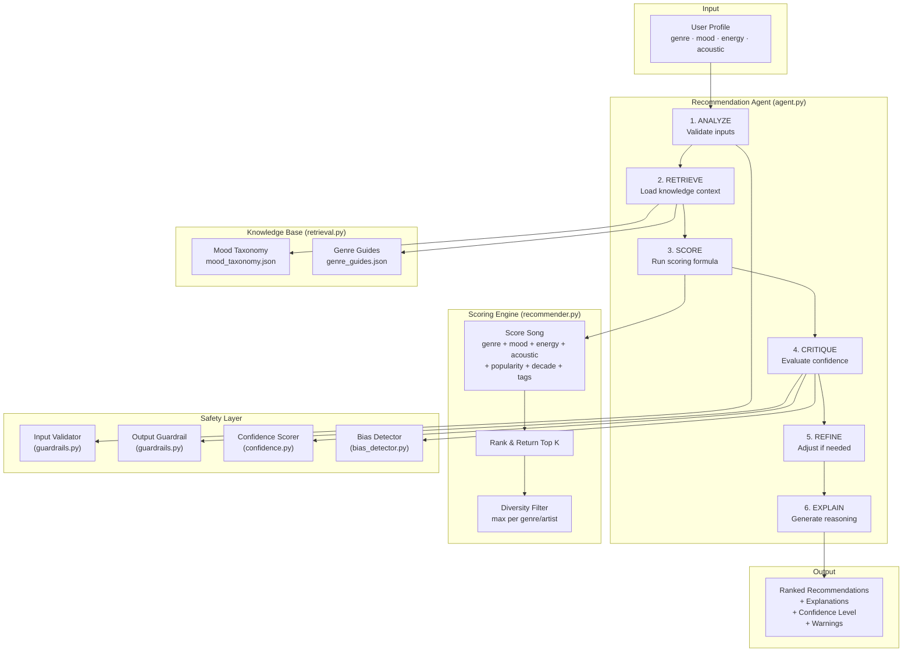

# System Architecture: VibeFinder 2.0

## Overview

VibeFinder 2.0 is a modular, agentic music recommendation system that extends a simple content-based recommender into a full applied AI system with knowledge retrieval, bias detection, guardrails, and confidence scoring.

## Architecture Diagram

## Module Responsibilities

| Module | File | Purpose |
|--------|------|---------|
| **Recommender** | `src/recommender.py` | Core scoring formula, ranking, diversity filter, scoring modes |
| **Retrieval** | `src/retrieval.py` | RAG-style knowledge loading: mood similarity taxonomy + genre relationship guides |
| **Agent** | `src/agent.py` | 6-step agentic planning loop: analyze → retrieve → score → critique → refine → explain |
| **Bias Detector** | `src/bias_detector.py` | Fairness metrics: genre coverage, lockout detection, diversity index, contradiction detection |
| **Guardrails** | `src/guardrails.py` | Input validation (type/range checks) + output quality checks (score thresholds, diversity) |
| **Confidence** | `src/confidence.py` | Multi-factor confidence scoring + self-critique for each recommendation set |

## Data Flow

1. **User submits preferences** → genre, mood, energy target, acoustic preference
2. **Agent validates** via InputValidator → catches invalid/missing fields
3. **Agent retrieves knowledge** → mood taxonomy provides similarity scores, genre guides provide related genres and typical energy ranges
4. **Scoring engine runs** → each song scored against preferences using weighted formula
5. **Agent critiques results** → ConfidenceScorer evaluates score quality, genre coverage, profile coherence, score spread
6. **Agent refines if needed** → low confidence triggers mode switching (e.g., balanced → mood_first)
7. **Output generated** → ranked songs + explanations + confidence level + warnings

## Design Decisions

### Why RAG-style retrieval instead of API calls?
The knowledge bases (mood taxonomy, genre guides) are stored as local JSON files. This keeps the system:
- **Self-contained** — no API keys, no network dependencies
- **Deterministic** — same input always produces same output
- **Inspectable** — anyone can read the JSON to understand what the system "knows"

### Why an agentic loop instead of a simple function call?
The 6-step agent demonstrates the pattern of plan → execute → evaluate → refine:
- Steps are logged for full transparency
- The critique step enables self-correction (mode switching on low confidence)
- Each step has explicit input/output making the reasoning chain auditable

### Why separate bias detection from guardrails?
- **Guardrails** operate on individual inputs/outputs (is this profile valid? are these results good enough?)
- **Bias detection** operates across multiple profiles (is the system fair to all users? which groups are underserved?)
- Keeping them separate enables different evaluation cadences (guardrails per-request, bias detection periodic)
